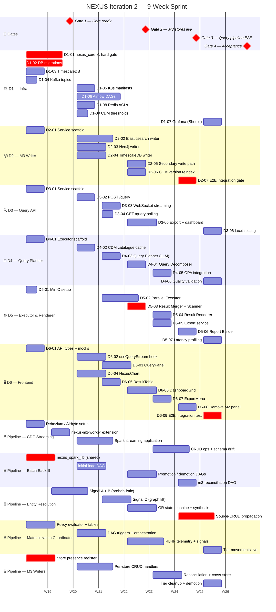

# NEXUS — Iteration 2 · Developer Sprint Plan
**6-Workstream Task Breakdown · 9-Week Window**
Mentis Consulting · Version 0.4 · April 2026 · Confidential

> **v0.4 changes from v0.3 (2026-04-28):**
> 1. **Spec filenames updated throughout** — all references updated to the new `SPEC`/`REF` prefix convention and latest versions (e.g. `NEXUS-Iter2-SPEC-ServiceTopology-v0.4.md`, `NEXUS-Iter2-SPEC-CDM-Mapper-v0.3.md`).
> 2. **Developer naming reconciled** — the Dev1–Dev5 pipeline-seam streams and the Dev1–Dev6 workstream split have been reconciled (see §Developer Assignments). Pipeline specs are now named by component (CDC Streaming, Batch Backfill, Entity Resolution, Materialization Coordinator, M3 Writers); developer-identity assignments removed from individual spec files. This sprint plan remains the authoritative assignment document.
> 3. **Gantt chart added** — a Mermaid Gantt covering all workstreams and pipeline streams is inserted after Phase Gates.
> 4. **OQ table updated** — OQ-DM-07 resolved; ES vector store confirmed (Pinecone refs cleared).
> 5. **Summary table updated** — pipeline stream person-weeks added alongside the D1–D6 estimates.
>
> **v0.3 changes from v0.2:**
> 1. **Kafka topic names corrected throughout** — `{tid}.nexus.query_requested` → `{tid}.query.submitted`; `{tid}.nexus.query_result` → `{tid}.query.event`. Aligns with the canonical names in `NEXUS-Iter2-SPEC-ServiceTopology-v0.4.md` and `NEXUS-Iter2-SPEC-QueryEngine-v0.3.md`. Affects D1-01, D1-04, D3-01, D3-02, D3-03, D4-01, D5-02, D6-02.
> 2. **Related spec references updated** — DataModel and M3 AIStores references bumped to v0.4.
> 3. **Gate 1 timeline adjusted** — `nexus_core` hard-gate moved to end of Week 2 (was implied Week 1). Gate 1 condition refined to reflect realistic delivery window.
> 4. **D1-01 estimate revised** — 3 days → 4 days to reflect expanded v0.2 scope (per-tenant schema, search_path, TenantConfigService).
> 5. **OQ-M3-DEL-01 resolved** — Infra spec decision accepted: entity deletion uses a dedicated `{tid}.m1.entity_removed` topic. M3 writer task descriptions updated; D1-04 topic list updated accordingly.
> 6. **Dev 4 Phase 3 task added** — D4-06: Query Planner quality validation and latency contribution.
> 7. **D5-06 dependencies tightened** — D5-01 and PromptRegistry template confirmation added to dependency list.
> 8. **Open questions table updated** — OQ-M3-DEL-01 closed; remaining blocking OQs flagged with resolution deadline (pre-sprint sync).
>
> **v0.2 changes from v0.1:** Data architecture decisions incorporated throughout. New tasks D1-08 (Redis security) and D1-09 (CDM mapper threshold loading). D1-01 extended with per-tenant schema support in `nexus_core`. D1-02 expanded with six new tables. D1-06 gains a third Airflow DAG for sub-result cleanup. D5-02 extended with sub-result persistence. D5-03 extended with two-phase pre-join. Two new open questions added. Dev 1 task count rises from 7 to 9.

---

## Overview

This document breaks Iteration 2 into developer-assigned tasks across three phases covering a 9-week delivery window. Work is distributed across 6 developers with a backend/frontend/data-infra specialisation mix.

**Three new services delivered in Iteration 2:**
- `nexus-m3-writer` — populates Elasticsearch, Neo4j, and TimescaleDB from CDM events
- `nexus-query-api` — stateless HTTP + WebSocket entry point for natural language queries
- `nexus-query-executor` — four-component pipeline: Query Planner → Decomposer → Parallel Executor → Merger/Renderer

**Related specs (query engine + frontend workstreams):**
- `NEXUS-Iter2-SPEC-ServiceTopology-v0.4.md`
- `NEXUS-Iter2-SPEC-DataModel-v0.5.md`
- `NEXUS-Iter2-SPEC-M3-AIStores-v0.4.md`
- `NEXUS-Iter2-SPEC-QueryEngine-v0.3.md`
- `NEXUS-Iter2-SPEC-VisualOutputs-v0.2.md`
- `NEXUS-Iter2-SPEC-M6-FrontendDelta-v0.2.md`
- `NEXUS-Iter2-SPEC-CDM-Mapper-v0.3.md`
- `NEXUS-Iter2-SPEC-CDM-Validation-Workflow-v0.1.md`
- `NEXUS-Iter2-SPEC-RHMA-v0.1.md`

**Related specs (CDM-to-AIStores pipeline streams):**
- `NEXUS-Iter2-SPEC-PipelineRegisters-v0.1.md` — stream coordination + system registers
- `NEXUS-Iter2-SPEC-CDCStreaming-v0.1.md` — 4 person-weeks
- `NEXUS-Iter2-SPEC-Backfill-v0.1.md` — 4 person-weeks
- `NEXUS-Iter2-SPEC-ER-CRUD-v0.1.md` — 6 person-weeks
- `NEXUS-Iter2-SPEC-MaterializationCoordinator-v0.1.md` — 5 person-weeks
- `NEXUS-Iter2-SPEC-M3-Writers-v0.1.md` — 5 person-weeks (aligns with D2)

---

## Developer Assignments

### Workstream split (D1–D6) — query engine, frontend, infra

| Workstream | Specialisation | Primary deliverable | Tasks |
|---|---|---|---|
| **D1 — Infra** | Data / Infra | Platform foundation: DB migrations, Kafka topics, Airflow DAGs, Kubernetes, `nexus_core` | D1-01 → D1-09 |
| **D2 — M3 Writer** | Backend | `nexus-m3-writer` — Elasticsearch, Neo4j, TimescaleDB writes | D2-01 → D2-07 |
| **D3 — Query API** | Backend | `nexus-query-api` — HTTP + WebSocket entry point, export & dashboard endpoints | D3-01 → D3-06 |
| **D4 — Planner** | Backend | `nexus-query-executor` — Query Planner + Decomposer + OPA | D4-01 → D4-06 |
| **D5 — Executor** | Backend | `nexus-query-executor` — Parallel Executor + Result Merger + Renderer + Reports | D5-01 → D5-07 |
| **D6 — Frontend** | Frontend | M6 React delta — query UI, charts, dashboard grid, exports | D6-01 → D6-09 |

### Pipeline stream split — CDM-to-AIStores seam (24 person-weeks)

These five streams implement the M1→M3 data pipeline running in parallel with the D1–D6 workstreams. Stream names replaced the old Dev1–Dev5 pipeline naming (April 2026). Mapping to workstreams:

| Pipeline stream | Person-weeks | Primary workstream overlap | Spec |
|---|---|---|---|
| **CDC Streaming** | 4 | D1 (nexus-m1-worker ext.), D2 (entity_routed consumer) | `NEXUS-Iter2-SPEC-CDCStreaming-v0.1.md` |
| **Batch Backfill** | 4 | D1 (Airflow DAG family), D2 (m3-reconciliation) | `NEXUS-Iter2-SPEC-Backfill-v0.1.md` |
| **Entity Resolution** | 6 | D2 (nexus_spark_lib, GR state machine) | `NEXUS-Iter2-SPEC-ER-CRUD-v0.1.md` |
| **Materialization Coordinator** | 5 | D1 (policy tables), D2 (tier DAGs) | `NEXUS-Iter2-SPEC-MaterializationCoordinator-v0.1.md` |
| **M3 Writers** | 5 | D2 (nexus-m3-writer + store presence) | `NEXUS-Iter2-SPEC-M3-Writers-v0.1.md` |

Phase gate sequencing for pipeline streams: see `NEXUS-Iter2-SPEC-PipelineRegisters-v0.1.md` §2.2.

---

## Phase Gates

| Gate | Week | Condition |
|---|---|---|
| **Gate 1 — Core ready** | End of Week 2 | `nexus_core` v2 published and available on internal PyPI; all DB migrations (V2.0.1–V2.0.8) applied to staging; Kafka topics provisioned; `tenant_configs` seeded with platform defaults for all active tenants; CDM mapper reading thresholds from DB |
| **Gate 2 — M3 stores live** | End of Week 5 | `nexus-m3-writer` consuming `{tid}.m1.entity_routed` and writing to all three stores |
| **Gate 3 — Query pipeline end-to-end** | End of Week 7 | Full query round-trip: `POST /query` → planner → executor → sub-results persisted → pre-join → renderer → WebSocket result |
| **Gate 4 — Acceptance** | End of Week 9 | All Must-priority FRs passing; P95 latency targets met; M6 UI connected to live backend |

> ⚠️ **Internal milestone — `nexus_core` draft by end of Week 1:** D1-01 targets a reviewable draft (not necessarily published) by end of Week 1 so that other developers can begin scaffolding against it. Final publication to internal PyPI is the Gate 1 condition (end of Week 2). If D1-01 is not in draft by end of Week 1, escalate immediately — every other team loses Phase 2 lead time.

---

## Sprint Gantt Chart

Assuming sprint kickoff **2026-05-04 (Week 1)**. Gates shown as milestones. Critical-path tasks marked `crit`. Pipeline streams shown separately below the D1–D6 workstreams.



> **Reading the chart:** `crit` (red) = on the critical path to the next gate. Pipeline streams overlap with D1/D2 scope — they are the implementation detail underneath the store-write and infra workstreams. Gate milestones appear at the top; align all streams to them.

---

## DEV 1 — Data / Infra
**Specialisation:** Platform, databases, Kafka, Kubernetes
**Workstream:** Foundation layer — unblocks all other developers

> ⚠️ `nexus_core` is a hard gate: if not merged by end of Week 1, every other team is blocked. This is Dev 1's top priority.

---

### Phase 1 — Foundation (Weeks 1–2)

#### TASK D1-01 · `nexus_core` — Iteration 2 additions
**Priority:** Must · **Depends on:** —
**Spec:** `NEXUS-Iter2-SPEC-LIB-NexusCore-v0.3.md`

Extend the `nexus_core` shared library with Iteration 2 additions. All services import from `nexus_core`; this must be in reviewable draft by end of Week 1 and published to internal PyPI by end of Week 2 (Gate 1 hard dependency).

- Add `CrossModuleTopicNamer` entries for all new Iteration 2 Kafka topics:
  - `{tid}.m1.entity_routed` (produced by `m1-ai-router`, consumed by `nexus-m3-writer`)
  - `{tid}.m1.entity_removed` (produced by `m1-ai-router`, consumed by `nexus-m3-writer` — entity deletion; see OQ-M3-DEL-01 resolved below)
  - `{tid}.query.submitted` (produced by `nexus-query-api`, consumed by `nexus-query-executor`)
  - `{tid}.query.event` (produced by `nexus-query-executor`, consumed by `nexus-query-api`)
- Add `TenantContext`-aware helper for TimescaleDB connections (RLS policy required)
- **Update `get_tenant_scoped_connection()`**: in addition to setting `nexus.current_tenant_id` (for RLS on `nexus_system` tables), also set `search_path = tenant_{id}, nexus_system, pg_catalog` so that unqualified references to `query_sessions` and `query_sub_results` resolve to the correct per-tenant schema automatically. Tenant ID is slugified (`acme-corp` → `tenant_acme_corp`) for schema name safety.
- **Update `onboard_tenant()`**: add Step 3a — create schema `tenant_{id}` and provision `query_sessions` + `query_sub_results` tables within it (DDL defined in D1-02). Schema is created with `REVOKE ALL ON SCHEMA FROM PUBLIC; GRANT USAGE TO nexus_app` to ensure no cross-tenant schema access.
- Add `TenantConfigService.get_thresholds(tenant_id)` stub (fully implemented in D1-09, but the interface must be published here so D1-09 and the CDM mapper can depend on it without a circular release).
- Publish new minor version of `nexus_core` to internal PyPI
- Reference: `NEXUS-Iter2-SPEC-ServiceTopology-v0.4.md` → Consumer Group Registry

**Acceptance:** `from nexus_core.topics import CrossModuleTopicNamer` resolves all new Iteration 2 topics including `query.submitted` and `query.event`. `get_tenant_scoped_connection()` sets both `nexus.current_tenant_id` and `search_path`. `onboard_tenant()` creates per-tenant schema and tables. Unit tests green.

---

#### TASK D1-02 · Database migrations — Iteration 2 tables
**Priority:** Must . **Depends on:** D1-01
**Spec:** `NEXUS-Iter2-SPEC-DataModel-v0.5.md`

Apply all Iteration 2 database migrations to staging and production schemas. This task is expanded in v0.2 to include the full data architecture for multi-tenant configuration and query intermediary storage.

**Migrations in `nexus_system` (shared schema, RLS):**

- **V2.0.1 — `nexus_system.tenant_configs`** — per-tenant application settings. Typed columns for hot-path settings (CDM tier thresholds) plus a `settings JSONB` for all other tenant-level config. A default row is inserted for every active tenant during migration with platform defaults.
  ```
  tenant_id                TEXT PRIMARY KEY      ← FK → nexus_system.tenants
  cdm_tier1_min_confidence DECIMAL(4,3) DEFAULT 0.95
  cdm_tier2_min_confidence DECIMAL(4,3) DEFAULT 0.70
  snapshot_retention_months INT          DEFAULT 12
  max_connectors           SMALLINT     DEFAULT 10
  pii_detection_enabled    BOOLEAN      DEFAULT true
  default_output_persona   TEXT         DEFAULT 'default'
  settings                 JSONB        DEFAULT '{}'
  created_at               TIMESTAMPTZ  DEFAULT NOW()
  updated_at               TIMESTAMPTZ  DEFAULT NOW()
  ```
  RLS: `tenant_id = current_setting('nexus.current_tenant_id')`.

- **V2.0.2 — `nexus_system.tenant_config_history`** — immutable audit log of all changes to `tenant_configs`. Written by a trigger on `tenant_configs` UPDATE. Allows a tenant admin to see who changed which threshold and when.
  ```
  history_id    UUID PRIMARY KEY DEFAULT gen_random_uuid()
  tenant_id     TEXT NOT NULL
  changed_by    TEXT NOT NULL     ← user_id from Kong header
  changed_at    TIMESTAMPTZ DEFAULT NOW()
  field_name    TEXT NOT NULL
  old_value     TEXT
  new_value     TEXT
  ```

- **V2.0.3 — `nexus_system.user_preferences`** — per-user settings scoped by `(tenant_id, user_id)`. Used by M6 to persist output format preferences, dashboard layouts, and locale.
  ```
  tenant_id     TEXT NOT NULL     ← RLS anchor
  user_id       TEXT NOT NULL     ← Okta sub claim
  preferences   JSONB DEFAULT '{}'
  updated_at    TIMESTAMPTZ DEFAULT NOW()
  PRIMARY KEY (tenant_id, user_id)
  ```

- **V2.0.4 — `nexus_system.cdm_proposals`** — pre-existing table in Iteration 1 implementation, DDL now formally documented. Stores CDM field classification proposals produced by the CDM mapper, including Tier 3 fields with `source_extras`.
  ```
  proposal_id   UUID PRIMARY KEY DEFAULT gen_random_uuid()
  tenant_id     TEXT NOT NULL     ← RLS anchor
  connector_id  UUID NOT NULL
  snapshot_id   UUID NOT NULL     ← FK → nexus_system.schema_snapshots
  source_table  TEXT NOT NULL
  source_field  TEXT NOT NULL
  tier          SMALLINT CHECK (tier IN (1,2,3))
  confidence    DECIMAL(5,2)
  cdm_entity    TEXT
  cdm_field     TEXT
  source_extras JSONB DEFAULT '{}'
  status        TEXT DEFAULT 'pending' CHECK (status IN ('pending','approved','rejected'))
  proposed_at   TIMESTAMPTZ DEFAULT NOW()
  UNIQUE (tenant_id, connector_id, snapshot_id, source_table, source_field)
  ```

- **V2.0.5 — `nexus_system.query_sessions`** — additive ALTER TABLE (pipeline discriminator, output_preference, result JSONB, query_plan JSONB, sources_queried, sources_failed, partial, cdm_version columns + new indexes). Note: this is a `nexus_system` table protected by RLS. Session metadata is lightweight; only the `result` JSONB column carries significant payload (final `RenderedOutput`). [CLARIFY: OQ-SCHEMA-01 — confirm whether `query_sessions` should be moved to per-tenant schema in a future migration for consistency with `query_sub_results`. Decision deferred; current design keeps it in `nexus_system` for simplicity.]

- **V2.0.6 — `nexus_system.dashboard_components`** — new table (component_id, tenant_id, created_by, title, output_type, query_session_id, chart_spec, refresh_schedule, last_refreshed_at, is_stale). RLS on `tenant_id`.

- **V2.0.7 — `nexus_system.cdm_catalogue_cache_log`** — new audit table.

- **V2.0.8 — `nexus_system.identity_mapping`** — new table + RLS policy (see `NEXUS-Iter2-SPEC-DataModel-v0.5.md` for full schema and `resolve_source_identity()` method).

**Migrations in per-tenant schemas (created by `onboard_tenant()` in D1-01):**

Each tenant schema `tenant_{id}` receives these two tables. They are created during tenant onboarding, not via a global migration script. A migration utility function iterates all active tenants and applies DDL changes when the table structure evolves.

- **`query_sessions`** (per-tenant) — session state for the Query Engine. Isolated per tenant to prevent autovacuum contention and to support per-tenant data purge (GDPR). No RLS needed: schema isolation is the boundary.
  ```
  session_id        TEXT PRIMARY KEY
  user_id           TEXT NOT NULL
  query_text        TEXT NOT NULL
  status            TEXT DEFAULT 'pending'
  pipeline          TEXT DEFAULT 'query'
  output_preference TEXT
  query_plan        JSONB
  result            JSONB
  sources_queried   TEXT[]
  sources_failed    TEXT[]
  partial           BOOLEAN DEFAULT false
  cdm_version       TEXT
  created_at        TIMESTAMPTZ DEFAULT NOW()
  updated_at        TIMESTAMPTZ DEFAULT NOW()
  ```

- **`query_sub_results`** (per-tenant) — intermediary table for multi-system queries. Each row holds the raw result from one backend sub-query for one session. The Result Merger (D5-03) reads all completed rows for a session before running the pre-join step. Rows older than 48 hours are swept by the Airflow cleanup DAG (D1-06). No RLS needed: schema isolation is the boundary.
  ```
  sub_result_id   UUID PRIMARY KEY DEFAULT gen_random_uuid()
  session_id      TEXT NOT NULL     ← FK → query_sessions
  sub_query_index SMALLINT NOT NULL ← order within decomposed plan
  source_system   TEXT NOT NULL
  connector_id    UUID NOT NULL
  dialect         TEXT NOT NULL     ← SOQL / SQL / Cypher / ANN
  query_text      TEXT              ← exact query executed (audit + replay)
  status          TEXT DEFAULT 'pending' CHECK (status IN ('pending','running','completed','failed'))
  result_rows     JSONB             ← raw result set (array of row objects)
  row_count       INT
  executed_at     TIMESTAMPTZ
  duration_ms     INT
  error_message   TEXT
  created_at      TIMESTAMPTZ DEFAULT NOW()
  INDEX (session_id, status)        ← used by merger to find all completed rows
  ```

**Acceptance:** All migrations applied cleanly; rollback scripts tested; `tenant_configs` populated with defaults for all active tenants; per-tenant schemas created for all active tenants with both tables present; `query_sub_results` index confirmed.

---

#### TASK D1-03 · TimescaleDB — hypertables and continuous aggregates
**Priority:** Must · **Depends on:** D1-01
**Spec:** `NEXUS-Iter2-SPEC-DataModel-v0.5.md` · `NEXUS-Iter2-SPEC-M3-TimescaleDB-Writer-v0.1.md`

Provision `nexus_ts` schema and TimescaleDB-specific objects. This is a prerequisite for Dev 2 (M3 writer) and Dev 5 (metrics rendering).

- Create `nexus_ts.business_metrics_raw` hypertable with:
  - RLS policy (`tenant_id = current_setting('app.tenant_id')`)
  - 3-month retention policy
  - Compression after 7 days
- Create continuous aggregates: `nexus_ts.metrics_weekly` (12-month retention), `nexus_ts.metrics_monthly` (6-year retention), `nexus_ts.metrics_yearly` (permanent)
- Create `nexus_ts.platform_metrics` hypertable (NEXUS service observability metrics)
- Verify TimescaleDB extension installed and licensed in staging environment

**Acceptance:** Hypertables created; `SELECT * FROM timescaledb_information.hypertables` lists all four tables; INSERT test from Dev 2's dev environment succeeds.

---

#### TASK D1-04 · Kafka topic provisioning
**Priority:** Must · **Depends on:** D1-01
**Spec:** `NEXUS-Iter2-SPEC-ServiceTopology-v0.4.md`

Create all new Iteration 2 Kafka topics in staging cluster. Confirm consumer group naming per the Consumer Group Registry in `NEXUS-Iter2-SPEC-ServiceTopology-v0.4.md`.

- `{tid}.m1.entity_routed` — partitions: 6, retention: 7 days; produced by `m1-ai-router`, consumer group `m3-writer-entities`
- `{tid}.m1.entity_removed` — partitions: 3, retention: 7 days; produced by `m1-ai-router`, consumer group `m3-writer-entities` (deletion path; OQ-M3-DEL-01 resolved — dedicated topic, not an event_action flag)
- `{tid}.query.submitted` — partitions: 6, retention: 24h; produced by `nexus-query-api`, consumer group `query-executor`
- `{tid}.query.event` — partitions: 6, retention: 24h; produced by `nexus-query-executor`, consumer group `query-api-ws-relay`
- Confirm KEDA `KafkaTrigger` CRD is available in the cluster (needed by Dev 2 for autoscaling): `kubectl get crd | grep keda`

**Acceptance:** Topics visible in Kafka UI with correct partition and retention settings; KEDA CRD confirmed; Dev 2 and Dev 3 can publish/consume in dev.

---

### Phase 2 — Implementation (Weeks 3–6)

#### TASK D1-05 · Kubernetes manifests — 3 new services
**Priority:** Must · **Depends on:** D1-01, D1-04
**Spec:** `NEXUS-Iter2-SPEC-ServiceTopology-v0.4.md`

Write Kubernetes `Deployment`, `Service`, and `HPA`/`ScaledObject` manifests for the three new services.

- `nexus-query-api`: `Deployment` (2 replicas min), `Service` (port 8005), `HPA` (CPU ≥ 70%)
- `nexus-query-executor`: `Deployment` (KEDA `ScaledObject` based on `{tid}.query.submitted` lag, min 1 replica)
- `nexus-m3-writer`: `Deployment` (KEDA `KafkaTrigger` on `{tid}.m1.entity_routed` lag, scale-to-zero allowed)
- Apply network policies: only Kong namespace may send headers to `nexus-query-api`
- Add service accounts with correct RBAC for Kafka, Redis, and database access

**Acceptance:** All three services deployable via ArgoCD to staging; network policy tested (`curl` from non-Kong namespace returns 403).

---

#### TASK D1-06 · Airflow DAGs — batch history ingest, dashboard refresh, TimescaleDB maintenance, sub-result purge
**Priority:** Must · **Depends on:** D1-02, D1-03, D1-05
**Spec:** `NEXUS-Iter2-SPEC-Backfill-v0.1.md`

Implement four Airflow DAGs supporting Iteration 2 operations. See `NEXUS-Iter2-SPEC-ServiceTopology-v0.4.md` for full DAG specifications.

**DAG 1 — `nexus_batch_history_ingest`** (triggered on connector registration + manual re-trigger):

Drives Airbyte connector jobs for historical data backfill — the primary mechanism for populating M3 stores from pre-Iteration-2 enterprise data. This is the batch lane described in `NEXUS-Iter2-REF-CDM-AIStores-Pipeline-v0.1.md`.

- On trigger: read connector config from `nexus_system.connector_batch_state` (`years_back`, `batch_size`, `cursor_field`, `last_cursor_value`)
- Launch Airbyte sync job for the connector with the cursor config; records flow to `m1.int.raw_records` → CDM Mapper → AI Store Router → nexus-m3-writer (same path as real-time CDC)
- After each committed batch page: UPDATE `connector_batch_state.last_cursor_value` — survives DAG restarts without reprocessing history
- Alert `#nexus-data` on failure with connector_id, tenant_id, last committed cursor
- Re-triggerable: resetting `connector_batch_state.last_cursor_value` to `NULL` restarts from the full history window

**DAG 2 — `dashboard_component_refresh`:**
- Runs every 15 minutes
- Queries `nexus_system.dashboard_components` for components where `last_refreshed_at < NOW() - INTERVAL '1 hour'` (hourly) or `last_refreshed_at < NOW() - INTERVAL '24 hours'` (daily)
- POSTs refresh query to `nexus-query-api` per component; updates `last_refreshed_at` on success
- Sets `is_stale = TRUE` if refresh fails; alerts Grafana

**DAG 3 — `timescaledb_maintenance`:**
- Runs nightly at 03:00 UTC
- Calls `CALL refresh_continuous_aggregate(...)` for weekly/monthly/yearly aggregates
- Prunes `business_metrics_raw` rows older than 3 months
- Nightly Elasticsearch document deletion: hard-deletes documents with `deleted:true` and `deleted_at < NOW() - INTERVAL '24 hours'` via Delete By Query API

**DAG 4 — `query_sub_results_cleanup`:**
- Runs every 6 hours
- Iterates all active tenants from `nexus_system.tenants`
- For each tenant: `DELETE FROM tenant_{id}.query_sub_results WHERE created_at < NOW() - INTERVAL '48 hours'`
- Logs row counts per tenant for cost tracking
- 48-hour retention is intentional: long enough for replay on synthesis failure; short enough to contain table bloat

**Acceptance:** All four DAGs deployed and visible in Airflow UI. Batch history DAG: connector backfill runs end-to-end in staging; `connector_batch_state.last_cursor_value` committed after each page; re-trigger from NULL restarts cleanly. Dashboard refresh: `last_refreshed_at` correctly updated for hourly components. TimescaleDB maintenance: aggregates refresh and compression runs without errors; Elasticsearch `deleted:true` documents purged. Sub-result cleanup: old rows deleted and row counts logged per tenant.

---

### Phase 3 — Integration & Hardening (Weeks 7–9)

#### TASK D1-07 · Grafana dashboards — Iteration 2 observability
**Priority:** Should · **Depends on:** D1-06, Gate 3
**Spec:** `NEXUS-Iter2-SPEC-QueryEngine-v0.3.md` · `NEXUS-Iter2-SPEC-M3-AIStores-v0.4.md`

Add Grafana panels covering Iteration 2 SLOs.

- Query Engine P95 latency panels (single-source < 3s, cross-source < 5s targets from QE-NFR-01/02)
- `nexus-m3-writer` Kafka consumer lag panel (< 60s target from M3-NFR-04)
- CDM catalogue cache hit rate panel (≥ 95% target from QE-NFR-06)
- `CrossTenantSafetyScanner` security violation alert (Grafana alert → Slack, from Rule 7)
- TimescaleDB insert throughput panel (≥ 1,000 rows/s target from M3-NFR-03)

**Acceptance:** Panels visible in staging Grafana; security violation alert fires correctly in a test run.

---

#### TASK D1-08 · Redis key namespace convention and per-tenant ACLs
**Priority:** Must · **Depends on:** D1-01
**Spec:** `NEXUS-Iter2-SPEC-LIB-NexusCore-v0.3.md`

Formalise the Redis multi-tenancy security model. Without this, tenant isolation in Redis relies entirely on application convention — a bug constructing a cache key with the wrong `tenant_id` would silently serve another tenant's cached data.

**Key namespace convention (enforce across all services):**
```
nexus:{tenant_id}:cdm:{source_system}:{table}:{field}   ← CDM mapper classification cache
nexus:{tenant_id}:pii:{source_system}                    ← PIIChecker field list cache
nexus:{tenant_id}:qsess:{session_id}                     ← Query session WebSocket pod registry
nexus:{tenant_id}:cfg:tenant                             ← tenant_configs hot cache (TTL: event-driven)
```
Document this convention in `nexus_core` — a `RedisKeyBuilder` utility class enforces the format and raises `ValueError` if `tenant_id` is empty or `None`.

**Per-tenant Redis ACLs (Redis 6+):**
- Add a step to `onboard_tenant()`: create a Redis ACL user `nexus_app_{tenant_id}` with key pattern `nexus:{tenant_id}:*` only
- Service connections use the tenant-scoped ACL user when performing tenant-specific cache operations
- A bug producing a key for a different `tenant_id` results in a Redis `NOPERM` error rather than a silent data leak
- The platform ACL user (`nexus_app`) retains full access for migration and admin operations

**Acceptance:** `RedisKeyBuilder` unit tests pass including `ValueError` on missing `tenant_id`; ACL user created for two test tenants; test confirms `nexus_app_alpha` cannot read or write keys under `nexus:beta:*`.

---

#### TASK D1-09 · CDM mapper — load tier thresholds from `tenant_configs`
**Priority:** Must · **Depends on:** D1-02
**Spec:** `NEXUS-Iter2-SPEC-CDM-Mapper-v0.3.md` · `NEXUS-Iter2-SPEC-LIB-NexusCore-v0.3.md`

The CDM mapper (`nexus-cdm-mapper`, Iteration 1 service) currently uses hardcoded tier thresholds (Tier 1 ≥ 0.95, Tier 2 ≥ 0.70). With `tenant_configs` now available, these must be loaded per-tenant so that each tenant can apply their own classification policy.

- Add `TenantConfigService.get_thresholds(tenant_id) → (tier1_min, tier2_min)` to `nexus_core` — reads from `nexus_system.tenant_configs`, cached in Redis under `nexus:{tenant_id}:cfg:tenant` (event-driven TTL: flushed when `tenant_configs.updated_at` changes)
- Update CDM mapper's `classify_field()` to call `get_thresholds()` instead of using module-level constants
- Threshold changes apply to new classification runs only — existing approved mappings are not retroactively affected (see OQ-TENANT-01)
- Default row in `tenant_configs` uses platform defaults (0.95 / 0.70), preserving existing behaviour for all current tenants

**Acceptance:** CDM mapper classifies fields using thresholds from `tenant_configs`; changing `cdm_tier1_min_confidence` to 0.99 for `test-tenant-alpha` results in all classifications for alpha using the new threshold; `test-tenant-beta` continues using platform default; cache invalidation confirmed after config update.

---

---

## DEV 2 — Backend · nexus-m3-writer
**Specialisation:** Backend, data pipelines
**Workstream:** M3 AI Store writes — Elasticsearch, Neo4j, TimescaleDB

---

### Phase 1 — Foundation (Weeks 1–2)

#### TASK D2-01 · Service scaffold — nexus-m3-writer
**Priority:** Must · **Depends on:** D1-01
**Spec:** `NEXUS-Iter2-SPEC-M3-AIStores-v0.4.md` · `NEXUS-Iter2-SPEC-M3-Writers-v0.1.md`

Bootstrap the `nexus-m3-writer` Python service using `nexus_core` conventions.

- FastAPI app with `/health` endpoint reporting per-store connectivity (`elasticsearch_ok`, `neo4j_ok`, `timescaledb_ok`)
- Kafka consumer setup using `nexus_core` consumer helpers; consumer groups `m3-writer-entities` (primary write path — `{tid}.m1.entity_routed` and `{tid}.m1.entity_removed`), `m3-writer-mapping-approved` (catch-up)
- Environment config: `ELASTICSEARCH_URL`, `ELASTICSEARCH_API_KEY`, Neo4j Aura URI, TimescaleDB DSN, Kafka brokers
- Dockerfile + basic tests

**Acceptance:** Service starts cleanly; `/health` returns 200 with store connectivity status; consumer connects to staging Kafka.

---

### Phase 2 — Implementation (Weeks 3–6)

#### TASK D2-02 · Elasticsearch writer — vector upserts
**Priority:** Must  · **Depends on:** D2-01, D1-04
**Spec:** `NEXUS-Iter2-SPEC-M3-Elasticsearch-Writer-v0.1.md` · `NEXUS-Iter2-SPEC-M3-Writers-v0.1.md`

Implement the Elasticsearch upsert path for CDM entities arriving via `{tid}.m1.entity_routed`. Full spec: `NEXUS-Iter2-SPEC-M3-Elasticsearch-Writer-v0.1.md`.

- Document ID: `cdm_entity_id` (used as Elasticsearch `_id`). Index: `nexus_{tenant_slug}_{cdm_entity_type_lower}`.
- Implement `build_entity_text(entity)` — transient embedding text construction with PII field exclusion (lookup via `nexus_system.schema_snapshots.column_profiles` with Redis caching)
- Call OpenAI `text-embedding-3-small` (1536 dimensions) to produce the vector
- Upsert via `_update` with `doc_as_upsert: true`. Fields: `dense_vector` (1536-dim, cosine), `tenant_id`, `cdm_entity_id`, `cdm_entity_type`, `cdm_version`, `source_system`, `provenance_hash`, `embedding_model_version`, `deleted: false`
- Field values are **never** stored in Elasticsearch document metadata — embedding text is discarded after `embed()` returns
- Idempotency: same `_id` replaces the existing document (Elasticsearch upsert is naturally idempotent)
- P95 target: < 500ms per entity (M3-NFR-01)

**Acceptance:** 1,000 test entities upserted; re-upsert of same entity produces no duplicate; PII field confirmed absent from Elasticsearch document; P95 latency measured and under target.

---

#### TASK D2-03 · Neo4j writer — graph nodes, edges, and deletion
**Priority:** Must · **Depends on:** D2-01, D1-04
**Spec:** `NEXUS-Iter2-SPEC-M3-Neo4j-Writer-v0.1.md` · `NEXUS-Iter2-SPEC-M3-Writers-v0.1.md`

Implement Neo4j write path for CDM entities. All writes use MERGE for idempotency.

- For each entity in `{tid}.m1.entity_routed`: MERGE node with `id` and `tenant_id` only (virtual CDM — no business field values on nodes)
- For relationship entities (e.g. `party.employee` with `reports_to`): MERGE relationship edge between the two entity IDs
- Apply `tenant_id` property to every node and every relationship (RLS equivalent for graph)
- **Entity deletion** (OQ-M3-DEL-01 resolved — dedicated `{tid}.m1.entity_removed` topic): on receipt of an `entity_removed` event, `MATCH (n {id: $id, tenant_id: $tenant_id}) DETACH DELETE n`. DETACH DELETE removes the node and all its relationships atomically.
- P95 MERGE latency target: < 200ms per node (M3-NFR-02)
- Confirm Neo4j constraint: `CREATE CONSTRAINT entity_id_unique IF NOT EXISTS FOR (e:Entity) REQUIRE (e.id, e.tenant_id) IS UNIQUE`

**Acceptance:** 500 entity MERGE operations in staging Neo4j; re-run produces no duplicates; `MATCH (n) WHERE n.tenant_id = 'tenant-a'` returns only Tenant A nodes (isolation confirmed); DETACH DELETE test: entity and its edges removed; sibling nodes unaffected.

---

#### TASK D2-04 · TimescaleDB writer — business metrics
**Priority:** Must · **Depends on:** D2-01, D1-03
**Spec:** `NEXUS-Iter2-SPEC-M3-TimescaleDB-Writer-v0.1.md` · `NEXUS-Iter2-SPEC-M3-Writers-v0.1.md`

Implement TimescaleDB insert path for CDM entities that carry a timestamp and a numeric value mapping.

- Filter incoming entities: only insert if entity has a `timestamp` field and at least one numeric metric field
- Insert row into `nexus_ts.business_metrics_raw`: `(tenant_id, source_system, entity_type, metric_name, normalised_value, base_currency, dimensions JSONB, cdm_version, event_time)`
- FX normalisation: call `FXService` to convert to EUR; store `original_currency` and `fx_rate` in `dimensions` JSONB for auditability
- Throughput target: ≥ 1,000 rows/second sustained (M3-NFR-03)
- Idempotency: check against `business_metrics_raw` before insert (deduplicate by `entity_id + event_time`)

**Acceptance:** Bulk insert test at 1,200 rows/s passes; duplicate row confirmed blocked; continuous aggregate `metrics_weekly` refreshes correctly from `business_metrics_raw`.

---

#### TASK D2-05 · Secondary write path — `{tid}.m4.mapping_approved` catch-up
**Priority:** Should · **Depends on:** D2-02, D2-03, D2-04
**Spec:** `NEXUS-Iter2-SPEC-M3-AIStores-v0.4.md` · `NEXUS-Iter2-SPEC-M3-Writers-v0.1.md`

Implement the secondary catch-up write handler for Tier 2→Tier 1 entity promotions.

- Consumer group `m3-writer-mapping-approved`
- On receipt of `{tid}.m4.mapping_approved`: re-embed the entity and upsert to Elasticsearch; MERGE Neo4j node if not already present; insert TimescaleDB row if applicable
- Partial store failure must not block the other two stores (M3-FR-05): each store write in independent try/except; log failures with full trace; no silent data loss (M3-NFR-07)
- Emit `cdm_version` metadata on all writes (M3-FR-10)

**Acceptance:** Simulated mapping_approved event triggers all three store writes; one store failure confirmed not to block the other two; failure logged with full trace.

---

#### TASK D2-06 · Batch re-embed on CDM version publish
**Priority:** Should ·  **Depends on:** D2-02
**Spec:** `NEXUS-Iter2-SPEC-M3-Elasticsearch-Writer-v0.1.md` · `NEXUS-Iter2-SPEC-M3-AIStores-v0.4.md`

When a new CDM version is published (`nexus.cdm.version_published`), trigger a targeted re-embed of all Elasticsearch documents for the affected entity types.

- Subscribe to `nexus.cdm.version_published` (consumer group `m3-writer-cdm-version`)
- For each entity type in the new CDM version: batch-fetch entity IDs from Elasticsearch, re-embed, re-upsert
- Targeted re-embed (only changed entity types) takes precedence over full rebuild — see re-embedding policy table in `NEXUS-Iter2-SPEC-M3-AIStores-v0.4.md`
- [CLARIFY: Full Elasticsearch index rebuild is a Should, not Must — confirm with team whether it is required for Iteration 2 acceptance or deferred to Iteration 3]

**Acceptance:** Test CDM version publish triggers re-embed of correct entity types only; new `cdm_version` metadata on re-upserted documents confirms correct version.

---

### Phase 3 — Integration & Hardening (Weeks 7–9)

#### TASK D2-07 · End-to-end integration — M1 → M3 pipeline gate
**Priority:** Must · **Depends on:** D2-02, D2-03, D2-04, Gate 2
**Spec:** `NEXUS-Iter2-SPEC-ServiceTopology-v0.4.md` · `NEXUS-Iter2-SPEC-M3-AIStores-v0.4.md`

Validate the Layer 2 data pipeline gate (Week 8–9 milestone from `NEXUS-Iter2-SPEC-ServiceTopology-v0.4.md`).

- Trigger a real `{tid}.m1.entity_routed` event in staging from `nexus-m1-worker`
- Confirm: Elasticsearch document exists for entity, Neo4j node exists, TimescaleDB row exists (if metric entity)
- Measure Kafka consumer lag under load (target < 60s steady state, M3-NFR-04)
- Confirm KEDA autoscaling fires when lag exceeds threshold

**Acceptance:** End-to-end test passes; consumer lag measurement documented; Gate 2 sign-off from Tech Lead.

---

---

## DEV 3 — Backend · nexus-query-api
**Specialisation:** Backend, REST/WebSocket APIs
**Workstream:** Query Engine HTTP entry point — accepts queries, streams results, serves exports

---

### Phase 1 — Foundation (Weeks 1–2)

#### TASK D3-01 · Service scaffold — nexus-query-api
**Priority:** Must · **Depends on:** D1-01
**Spec:** `NEXUS-Iter2-SPEC-QueryEngine-v0.3.md` · `NEXUS-Iter2-SPEC-LIB-NexusCore-v0.3.md`

Bootstrap `nexus-query-api` FastAPI service on port 8005.

- Kong header extraction: `X-Tenant-ID`, `X-User-ID`, `X-User-Role` (Rule 0 — no JWT decoding in the service)
- `TenantContext` populated per request using `nexus_core.context`
- `/health` endpoint
- Kafka producer setup (to publish `{tid}.query.submitted`)
- Kafka consumer setup (to receive `{tid}.query.event` and relay to WebSocket)

**Acceptance:** Service starts; `/health` 200; Kong headers correctly extracted and available in `TenantContext`.

---

### Phase 2 — Implementation (Weeks 3–6)

#### TASK D3-02 · POST /query — query submission endpoint
**Priority:** Must ·  **Depends on:** D3-01, D1-04
**Spec:** `NEXUS-Iter2-SPEC-QueryEngine-v0.3.md`

Implement the primary query submission endpoint.

```
POST /query
Headers: X-Tenant-ID, X-User-ID, X-User-Role (injected by Kong)
Body: { query, output_preference, context: { user_role, current_view, time_zone } }
Response: 202 Accepted { session_id }  — must return in < 200ms (QE-FR-01 / QE-NFR-03)
```

- Generate `session_id` (UUID)
- Persist new row to `tenant_{id}.query_sessions` (per-tenant schema via `get_tenant_scoped_connection()`) with `status = 'pending'`, `pipeline = 'query'`
- Publish `{tid}.query.submitted` Kafka message (NexusMessage envelope via `nexus_core`)
- Return `session_id` immediately — do not wait for execution
- Response time measured; must be < 200ms even under load

**Acceptance:** `POST /query` returns 202 with `session_id` in < 200ms; Kafka message confirmed published to `{tid}.query.submitted`; `query_sessions` row created in correct per-tenant schema.

---

#### TASK D3-03 · WebSocket endpoint — result streaming
**Priority:** Must ·  **Depends on:** D3-02
**Spec:** `NEXUS-Iter2-SPEC-QueryEngine-v0.3.md`

Implement the WebSocket streaming endpoint for real-time query progress events.

```
WebSocket: /query/{session_id}/ws
Events streamed: planning → decomposing → executing → result | error | timeout
Event envelope: { event, session_id, payload }
```

- On connection: validate `session_id` belongs to the requesting tenant (scoped lookup in `tenant_{id}.query_sessions`)
- Register WebSocket connection in Redis registry using `RedisKeyBuilder`: `nexus:{tenant_id}:qsess:{session_id}`
- Relay Kafka `{tid}.query.event` events (published by `nexus-query-executor`) to the registered WebSocket
- Connection drop handling: client disconnects gracefully; stale WebSocket registry entries cleaned up after TTL
- QE-NFR-03: streaming first event to UI < 300ms after `POST /query`

**Acceptance:** Full WebSocket round-trip test from `POST /query` → WebSocket connect → receive `planning` event → receive `result` event. Disconnection test: Redis entry cleaned up.

---

#### TASK D3-04 · GET /query/{session_id} — polling fallback
**Priority:** Must · **Depends on:** D3-02
**Spec:** `NEXUS-Iter2-SPEC-QueryEngine-v0.3.md`

Implement polling fallback for clients that cannot use WebSocket (QE-FR-03).

```
GET /query/{session_id}
Returns: { status: "pending" | "completed" | "failed", result: RenderedOutput | null }
```

- Status derived from `tenant_{id}.query_sessions.status`
- `result` field populated from `query_sessions.result` JSONB once executor completes
- Tenant isolation enforced by `get_tenant_scoped_connection()` — per-tenant schema prevents cross-tenant access

**Acceptance:** Polling client receives `pending` while query runs; receives `completed` with `RenderedOutput` after completion.

---

#### TASK D3-05 · Export and dashboard save endpoints
**Priority:** Must · **Depends on:** D3-03
**Spec:** `NEXUS-Iter2-SPEC-QueryEngine-v0.3.md` · `NEXUS-Iter2-SPEC-VisualOutputs-v0.2.md`

Implement result export and dashboard persistence endpoints (QE-FR-08, QE-FR-09).

```
POST /query/{session_id}/export
Body: { format: "xlsx" | "csv" | "pdf" }
Response: download URL or binary stream

POST /query/{session_id}/save-dashboard
Body: { title, refresh_schedule: "hourly" | "daily" }
Response: { component_id }

GET /dashboard/components
Response: list of saved components for tenant

DELETE /dashboard/components/{component_id}
```

- `/export`: delegates to Dev 5's export service; validates format against `can_export` list in `RenderedOutput`
- `/save-dashboard`: validates `can_save_dashboard = true` in `RenderedOutput`; inserts row into `nexus_system.dashboard_components`
- `GET /dashboard/components`: RLS-scoped query on `dashboard_components` for the tenant
- `DELETE`: soft-delete or hard-delete — [CLARIFY: confirm with team whether deleted dashboard components need to be audited]

**Acceptance:** Export endpoint returns valid file for each format; saved component appears in `GET /dashboard/components`; deleting component removes it from subsequent list responses.

---

### Phase 3 — Integration & Hardening (Weeks 7–9)

#### TASK D3-06 · Load testing — query API latency and concurrency
**Priority:** Must · **Depends on:** Gate 3
**Spec:** `NEXUS-Iter2-SPEC-QueryEngine-v0.3.md`

Run `k6` load tests against `nexus-query-api` in staging.

- `POST /query` response time P95 < 200ms at 50 concurrent sessions per tenant (QE-NFR-03, QE-NFR-05)
- WebSocket: 50 simultaneous connections per tenant, all receive streaming events
- Confirm Redis WebSocket registry scales correctly under concurrent load

**Acceptance:** k6 results logged; P95 targets met; no WebSocket connection leaks under 50 concurrent sessions.

---

---

## DEV 4 — Backend · nexus-query-executor (Planner + Decomposer)
**Specialisation:** Backend, LLM integration, OPA
**Workstream:** Query intelligence — turning NL queries into executable sub-query plans

---

### Phase 1 — Foundation (Weeks 1–2)

#### TASK D4-01 · Executor service scaffold
**Priority:** Must · **Depends on:** D1-01
**Spec:** `NEXUS-Iter2-SPEC-QueryEngine-v0.3.md`

Bootstrap `nexus-query-executor` Kafka consumer service.

- Kafka consumer for `{tid}.query.submitted` (consumer group `query-executor`)
- Kafka producer for `{tid}.query.event` (status events + final result)
- Publish intermediate events (`planning`, `decomposing`, `executing`) as Kafka messages — Dev 3 relays these to WebSocket
- `/health` endpoint

**Acceptance:** Service starts; consumes from `query_requested` topic; produces to `query_result` topic; health endpoint 200.

---

### Phase 2 — Implementation (Weeks 3–6)

#### TASK D4-02 · CDM catalogue cache
**Priority:** Must · **Depends on:** D4-01, D1-01
**Spec:** `NEXUS-Iter2-SPEC-QueryEngine-v0.3.md` · `NEXUS-Iter2-SPEC-LIB-AgentCore-v0.1.md`

Implement the CDM catalogue Redis cache used by the Query Planner as LLM context (QE-FR-11, QE-NFR-06).

- Cache key: `nexus:{tenant_id}:cdm:catalogue:{cdm_version}` (using `RedisKeyBuilder` from D1-08)
- Cache is populated by `CDMVersionPublishedHandler` on `nexus.cdm.version_published`
- `CDMCatalogueBuilder.get_relevant_subset()`: Elasticsearch kNN top-k filtering (max 15 entity types per query) to keep LLM context within token budget (Issue 4 from arch review)
- Cache hit rate target: ≥ 95% (QE-NFR-06)
- Cache TTL: invalidated on `nexus.cdm.version_published` event; otherwise does not expire during steady state

**Acceptance:** Cache hit measured at ≥ 95% in 200-query load test; cache correctly invalidated when a new CDM version event fires; Elasticsearch kNN subset confirmed at ≤ 15 entity types.

---

#### TASK D4-03 · Query Planner — LLM-based plan generation
**Priority:** Must · **Depends on:** D4-02
**Spec:** `NEXUS-Iter2-SPEC-QueryEngine-v0.3.md` · `NEXUS-Iter2-SPEC-LIB-AgentCore-v0.1.md`

Implement the Query Planner: calls an LLM to produce a `CDMQueryPlan` from the natural language query.

- Input: `{ query, output_preference, context, cdm_catalogue_subset }`
- LLM prompt: structured prompt using CDM entity types from the cache subset; asks the model to identify: query intent, required entity types, backend selector (live source / Elasticsearch / Neo4j / TimescaleDB / hybrid), suggested output type
- LLM call timeout: 8 seconds — if exceeded, reject query with `timeout` error event (QE-NFR-07)
- Output: `CDMQueryPlan { intent, entity_types, backends: [BackendTarget], output_type_suggestion }`
- Publish `planning` status event to `{tid}.query.event` as soon as plan is generated
- Persist `query_plan` JSONB to `tenant_{id}.query_sessions`

**Acceptance:** 20 representative queries produce sensible `CDMQueryPlan` outputs; timeout scenario returns `timeout` event within 8s; `query_plan` correctly persisted in `query_sessions`.

---

#### TASK D4-04 · Query Decomposer — native sub-query translation
**Priority:** Must · **Depends on:** D4-03
**Spec:** `NEXUS-Iter2-SPEC-QueryEngine-v0.3.md` · `NEXUS-Iter2-SPEC-DataModel-v0.5.md`

Implement the Query Decomposer: translates the `CDMQueryPlan` into native sub-queries per backend.

- SOQL translator (Salesforce): CDM entity → SOQL query. Date fields use bare `YYYY-MM-DD` format, not ISO 8601 datetime (Issue 3 from arch review)
- SQL translator (PostgreSQL/relational): CDM entity → parameterised SQL
- Cypher translator (Neo4j): CDM entity + relationship → Cypher MATCH/RETURN
- kNN translator (Elasticsearch): CDM entity → kNN query with top-k and filter (using `knn` query on `dense_vector` field)
- `identity_mapping` resolution: before emitting sub-queries, resolve `user_id` to source-system identity via `nexus_system.identity_mapping` for each target source (Rule 6). [CLARIFY: confirm `identity_mapping` seeding is complete — OQ-QE-06 / OQ-DM-06 from the spec]
- Publish `decomposing` status event to `{tid}.query.event`

**Acceptance:** Test CDMQueryPlan for each backend type produces a syntactically valid sub-query; SOQL date format confirmed as bare date; `identity_mapping` lookup resolves correctly for known users.

---

#### TASK D4-05 · OPA integration — pre-query authorisation
**Priority:** Must · **Depends on:** D4-04
**Spec:** `NEXUS-Iter2-SPEC-QueryEngine-v0.3.md` · `NEXUS-Iter2-SPEC-LIB-AgentCore-v0.1.md`

Implement synchronous OPA check before any source system is contacted (Rule 5, QE-FR-07).

- Call OPA synchronously with: `{ tenant_id, user_role, query_plan, sub_queries }` before the Parallel Executor runs
- OPA policy checks: user role authorised for requested entity types; PII columns not requested by non-authorised roles
- `PIIChecker` class: `is_pii()` lookup via `nexus_system.schema_snapshots.column_profiles` (Redis-cached using `RedisKeyBuilder`: `nexus:{tenant_id}:pii:{source_system}`, TTL 1 hour)
- OPA denial → publish `error` event to `{tid}.query.event`; **do not contact any source system**
- Latency of OPA call must not push total query latency over P95 targets

**Acceptance:** PII column request by unauthorised role blocked with `error` event; no source system contacted after OPA denial (confirmed by network log in staging); OPA call latency < 100ms P95.

---

### Phase 3 — Integration & Hardening (Weeks 7–9)

#### TASK D4-06 · Query Planner quality validation and latency contribution
**Priority:** Must · **Depends on:** Gate 3, D4-03, D4-04
**Spec:** `NEXUS-Iter2-SPEC-QueryEngine-v0.3.md`

Validate Query Planner output quality against the acceptance set and contribute the planner stage's latency profile to Dev 5's D5-07 report.

- Run the 20-query acceptance set defined in D4-03 against the live staging backend; document pass/fail per query with the full `CDMQueryPlan` output for failed cases
- Measure planner-stage latency in isolation (time from message consumed to `planning` event published on `{tid}.query.event`); target: P95 ≤ 8s (LLM timeout threshold)
- Run decomposer against each accepted plan; verify syntactic validity of all four sub-query types (SOQL, SQL, Cypher, ANN) on live staging schemas
- Document latency breakdown for D5-07 (planner stage + decomposer stage separately, to identify LLM vs translation bottlenecks)
- Confirm `identity_mapping` resolution works end-to-end for all active staging tenant users (closes OQ-QE-06 acceptance evidence)

**Acceptance:** ≥ 18/20 queries in acceptance set produce a valid `CDMQueryPlan` and a syntactically valid sub-query per targeted backend; planner P95 latency documented; decomposer latency documented; OQ-QE-06 acceptance evidence recorded.

---

---

## DEV 5 — Backend · nexus-query-executor (Executor + Renderer)
**Specialisation:** Backend, async execution, data rendering, document generation
**Workstream:** Parallel execution, result merging, visual output rendering, report generation

---

### Phase 1 — Foundation (Weeks 1–2)

#### TASK D5-01 · MinIO and export infrastructure setup
**Priority:** Must · **Depends on:** D1-01
**Spec:** `NEXUS-Iter2-SPEC-VisualOutputs-v0.2.md`

Configure MinIO bucket for report storage and set up export dependencies.

- MinIO bucket: `nexus-reports` (per-tenant prefix: `{tenant_id}/reports/`)
- Signed URL generation: TTL 15 minutes (VO-FR-11)
- Verify MinIO SDK available in service dependency list
- Install and test `openpyxl`, `fpdf2` (or equivalent), `python-docx` libraries

**Acceptance:** MinIO bucket created; signed URL generation tested; Python export libraries importable.

---

### Phase 2 — Implementation (Weeks 3–6)

#### TASK D5-02 · Parallel Executor — concurrent sub-query fan-out with result persistence
**Priority:** Must · **Depends on:** D4-04, D5-01, D1-02
**Spec:** `NEXUS-Iter2-SPEC-QueryEngine-v0.3.md`

Implement the Parallel Executor: fans out sub-queries to their respective backends concurrently, and persists each individual result to `query_sub_results` before the merge step.

- Use `asyncio.gather(*sub_query_coroutines, return_exceptions=True)` for concurrent execution
- Sub-query routing: SOQL → `connector_worker_client.query(source_id, soql, user_id)`; SQL → TimescaleDB or PostgreSQL; Cypher → Neo4j; kNN → Elasticsearch
- **Rule 4:** `nexus-query-executor` is the only service that calls live source systems. Route live-source queries via the connector-worker Kafka request-reply pattern with `user_id` forwarded (Rule 6)
- Two-phase pattern for Elasticsearch/Neo4j: Phase 1 retrieves `cdm_entity_id`s via kNN/Cypher, Phase 2 fetches live field values via `connector_worker_client.fetch_by_ids()`
- **Sub-result persistence:** as each sub-query coroutine completes (whether success or failure), immediately write a row to `tenant_{id}.query_sub_results` with `status = 'completed'` or `status = 'failed'`, `result_rows`, `row_count`, `duration_ms`, and `query_text`. This happens within the coroutine before `asyncio.gather` returns. Rationale: if the synthesis step (LLM call in D5-04) fails or times out, sub-results are available for replay without re-querying source systems.
- Partial failure handling (QE-FR-06): if one backend fails, mark its `query_sub_results` row as `failed`; include it in `sources_failed`; continue with remaining results rather than blocking
- Publish `executing` status event to `{tid}.query.event`

**Acceptance:** Query targeting 2 sources executes both in parallel; both sub-results written to `tenant_{id}.query_sub_results` before merge begins; simulated single-source failure: failed row in `query_sub_results` with `error_message`, partial result returned with failed source in `sources_failed`; `partial = true` in `RenderedOutput`; replay test: delete result from one sub-result row, re-run merge from `query_sub_results` — correct partial result returned without re-querying source.

---

#### TASK D5-03 · Result Merger — pre-join and CrossTenantSafetyScanner
**Priority:** Must · · **Depends on:** D5-02
**Spec:** `NEXUS-Iter2-SPEC-QueryEngine-v0.3.md` · `NEXUS-Iter2-SPEC-LIB-AgentCore-v0.1.md`

Implement the Result Merger (two-phase pre-join of sub-results before synthesis) and the `CrossTenantSafetyScanner` (post-synthesis cross-tenant safety check — Rule 7, QE-FR-15).

**Result Merger — two-phase pre-join:**
- Reads all `status = 'completed'` rows from `tenant_{id}.query_sub_results` for the current `session_id`
- **Phase 1 — structural join on `cdm_entity_id`:** For rows where the CDM mapper has previously linked source records, match them by `cdm_entity_id`. This is the deterministic join path — no LLM involvement. Example: Salesforce `Opportunity.owner_id` and Workday `Employee.emp_id` both resolve to the same `cdm_entity_id` and are merged into a single row.
- **Phase 2 — unlinked context pass-through:** Rows with no matching `cdm_entity_id` (e.g. from a newly registered connector with incomplete CDM mappings) are passed through as unlinked context rather than being dropped. The LLM synthesiser in D5-04 receives both the joined rows and the unlinked rows — it is responsible for contextual interpretation of the unlinked portion.
- Output: `MergedResult { joined_rows, unlinked_rows, sources_queried, sources_failed }`
- Builds `sources_queried` and `sources_failed` lists for `RenderedOutput`

**CrossTenantSafetyScanner (post-merge, pre-synthesis defence-in-depth layer):**
- Runs on the `MergedResult` before it is passed to the LLM synthesiser
- For every connector referenced in `MergedResult`: verify connector belongs to `session.tenant_id` (RLS-scoped lookup in `nexus_system.connectors`)
- If any connector is foreign to the tenant: reject as **hard failure** (not partial result); publish `security_violation` error event to `{tid}.query.event`; trigger Grafana alert
- Scanner timeout: 500ms — fail closed (treat as hard failure) if exceeded

**Acceptance:** Two-source query with shared `cdm_entity_id`: merged result contains one joined row per matched entity; unmatched rows passed through as unlinked context (confirmed in `MergedResult.unlinked_rows`); cross-tenant test: merge result referencing a connector from another tenant → hard failure confirmed; `security_violation` event published; Grafana alert fires; scanner timeout confirmed fail-closed.

---

#### TASK D5-04 · Result Renderer — charts, tables, text
**Priority:** Must · **Depends on:** D5-03
**Spec:** `NEXUS-Iter2-SPEC-VisualOutputs-v0.2.md` · `NEXUS-Iter2-SPEC-QueryEngine-v0.3.md`

Implement the `ResultRenderer`: converts `MergedResult` + `CDMQueryPlan` into a `RenderedOutput`.

- Pure function: same input always produces same output (no LLM calls for charts/tables)
- Persona output overrides applied before rendering (CFO: aggregation → BAR_CHART, trend → LINE_CHART; data_steward: all → TABLE; etc. — from `PERSONA_OUTPUT_OVERRIDE` in Visual Outputs spec)
- **TEXT output:** Markdown-formatted answer
- **TABLE output:** `TableOutput` with column type metadata (`currency`, `badge`, `date`, `text`) for M6 formatting (VO-FR-03)
- **BAR_CHART / LINE_CHART / PIE_CHART:** `ChartSpec` in Recharts-compatible JSON (VO-FR-02)
- All outputs include: `sources_queried`, `cdm_version`, `partial` flag, `summary` (one-sentence NL description), `can_save_dashboard`, `can_export` (VO-FR-04, VO-FR-13)
- Persist final `RenderedOutput` to `tenant_{id}.query_sessions.result` JSONB
- Publish `result` event to `{tid}.query.event`

**Acceptance:** 10 test queries produce correctly typed `RenderedOutput` for each output type; persona override confirmed for CFO and data_steward personas; `RenderedOutput` JSON validates against schema.

---

#### TASK D5-05 · Export service — xlsx, csv, pdf
**Priority:** Must · **Depends on:** D5-04
**Spec:** `NEXUS-Iter2-SPEC-VisualOutputs-v0.2.md`

Implement file export for tables and charts (QE-FR-08, VO-FR-05, VO-FR-06).

- `.xlsx`: use `openpyxl`; write table rows with column headers; apply number formatting for currency columns
- `.csv`: standard CSV from table data; include header row
- `.pdf`: tabular PDF with headers; use `fpdf2` or equivalent
- Charts export as data-only xlsx/csv (not image) — (VO-FR-06)
- Called by Dev 3's `/export` endpoint; returns file bytes or a download URL
- Validate that export format is in `RenderedOutput.can_export` before generating

**Acceptance:** xlsx, csv, and pdf exports generated for a 500-row table; chart export confirmed as data-only (no image); format validation blocks unsupported format requests.

---

#### TASK D5-06 · Report Builder — .docx generation
**Priority:** Must · **Depends on:** D5-04, D5-01, PromptRegistry templates confirmed in `NEXUS-Iter2-SPEC-VisualOutputs-v0.2.md`
**Spec:** `NEXUS-Iter2-SPEC-VisualOutputs-v0.2.md` · `NEXUS-Iter2-SPEC-LIB-AgentCore-v0.1.md`

Implement persona-aware `.docx` report generation (QE-FR-10, VO-FR-09, VO-FR-10, VO-FR-11).

> **Pre-condition:** Before starting this task, confirm that `NEXUS-Iter2-SPEC-VisualOutputs-v0.2.md` contains the full section template definitions for all three persona reports (CFO, CEO, data_steward). If templates are still placeholders, raise with Tech Lead before proceeding — LLM section writing cannot be implemented without finalised prompts.

- Persona-aware section templates: CFO report (Executive Summary, Financial Metrics, Source Breakdown, Trends); CEO report (Strategic Summary, KPIs); data_steward report (Data Quality, Lineage, Anomalies) — templates defined in Visual Outputs spec and registered in `PromptRegistry`
- Section writing with LLM via `agent_core.LLMClient`: `asyncio.gather` for parallel section writes (reduces generation from ~10s to ~2s for a 5-section report — Issue 8 from arch review)
- Report preview: first 500 characters included in `RenderedOutput.report.preview` (VO-FR-10)
- Store `.docx` in MinIO at `{tenant_id}/reports/{session_id}.docx` (MinIO bucket and signed URL infrastructure from D5-01)
- Serve via signed download URL (TTL 15 minutes) (VO-FR-11)

**Acceptance:** CFO persona generates correct section structure; parallel section writing confirmed (asyncio.gather, not sequential); report stored in MinIO; signed URL expires after 15 minutes; preview text appears in `RenderedOutput`.

---

### Phase 3 — Integration & Hardening (Weeks 7–9)

#### TASK D5-07 · Latency profiling and P95 target validation
**Priority:** Must · **Depends on:** Gate 3
**Spec:** `NEXUS-Iter2-SPEC-QueryEngine-v0.3.md`

Profile the full query execution pipeline against P95 latency targets.

- Single-source query P95 < 3s (QE-NFR-01)
- Cross-source query P95 < 5s for 2 sources (QE-NFR-02)
- Report generation target: < 15s total
- Identify and resolve any blocking bottlenecks (LLM call, OPA, Elasticsearch kNN, connector-worker round-trip)
- Document profiling results for Gate 4 sign-off

**Acceptance:** P95 targets met and documented; any latency outliers explained.

---

---

## DEV 6 — Frontend · M6 React Delta
**Specialisation:** Frontend — React, TypeScript, Recharts, Zustand
**Workstream:** Query Engine UI — query panel, streaming results, charts, dashboard, exports

> All Iteration 1 M6 components are unchanged. This is a delta-only build.
> Tech stack: React 18, TypeScript, Recharts, TailwindCSS, Zustand (state), React Query (server state), Vite.

---

### Phase 1 — Foundation (Weeks 1–2)

#### TASK D6-01 · API client and TypeScript types
**Priority:** Must · **Depends on:** D3-01 (scaffold only — full API not yet live)
**Spec:** `NEXUS-Iter2-SPEC-QueryEngine-v0.3.md` · `NEXUS-Iter2-SPEC-VisualOutputs-v0.2.md` · `NEXUS-Iter2-SPEC-M6-FrontendDelta-v0.2.md`

Set up API client and TypeScript interface definitions for all Query Engine endpoints and data structures.

```typescript
// Core types to define:
interface QuerySubmitRequest { query, output_preference, context }
interface QuerySubmitResponse { session_id }
interface QueryStreamEvent { event, session_id, payload }
interface RenderedOutput { output_type, title, summary, sources_queried, sources_failed,
                           cdm_version, partial, can_save_dashboard, can_export,
                           text_content?, table?, chart_spec?, report? }
interface ChartSpec { chart_type, title, x_axis_key, y_axis_keys, data, series_labels, currency }
interface TableOutput { columns: ColumnDef[], rows, total_rows }
```

- API client functions for: `POST /query`, `GET /query/{id}`, `POST /export`, `POST /save-dashboard`, `GET /dashboard/components`, `DELETE /dashboard/components/{id}`
- Mock API responses for all endpoints (for development before backend is live)
- Base WebSocket URL configuration via environment variable

**Acceptance:** TypeScript types compile without errors; mock API returns correct shapes; unit tests for type-guards pass.

---

### Phase 2 — Implementation (Weeks 3–6)

#### TASK D6-02 · `useQueryStream` hook — WebSocket + polling fallback
**Priority:** Must · **Depends on:** D6-01, D3-02 (backend available Week 3+)
**Spec:** `NEXUS-Iter2-SPEC-M6-FrontendDelta-v0.2.md` · `NEXUS-Iter2-SPEC-QueryEngine-v0.3.md`

Implement the core React hook for query submission and result streaming (M6-FR-02, M6-FR-11).

```typescript
function useQueryStream(sessionId: string | null): {
  events:  QueryStreamEvent[];
  result:  RenderedOutput | null;
  status:  "idle" | "planning" | "decomposing" | "executing" | "done" | "error";
  isPartial: boolean;
}
```

- Connect to `wss://{API_HOST}/query/{sessionId}/ws`
- On each `QueryStreamEvent`: update `status` and append to `events`
- WebSocket drop handling: reconnect once, then fall back to polling `GET /query/{session_id}` at 2-second intervals (M6-FR-11)
- Cleanup: close WebSocket on component unmount; cancel polling on completion
- First streaming event in UI target: < 300ms after submit (M6-NFR-01)

**Acceptance:** Hook tested with mock WebSocket server; status transitions through all phases; WebSocket drop triggers polling fallback; event list correctly accumulated.

---

#### TASK D6-03 · `<QueryPanel>` — main query input and result assembly
**Priority:** Must · **Depends on:** D6-02
**Spec:** `NEXUS-Iter2-SPEC-M6-FrontendDelta-v0.2.md`

Implement the top-level `<QueryPanel>` component — the primary Iteration 2 UI entry point (M6-FR-01).

- Query input: text area (max 2000 chars), output_preference selector (`auto | chart | table | text | report`), submit button
- On submit: call `POST /query`, receive `session_id`, initiate `useQueryStream`
- Progress indicator: display current status (`planning...`, `decomposing...`, `executing...`) from stream events
- On `result` event: render the appropriate output component (`<NexusChart>`, `<ResultTable>`, text, or report download)
- `<PartialResultBanner>`: shown when `partial = true` — warns user that some sources failed (M6-FR-10)
- No layout shift during streaming (M6-NFR-04, zero CLS)

**Acceptance:** Full manual test: query → streaming status updates → final result rendered; partial result banner shown correctly; no CLS during streaming.

---

#### TASK D6-04 · `<NexusChart>` — Recharts chart rendering
**Priority:** Must · **Depends on:** D6-01
**Spec:** `NEXUS-Iter2-SPEC-VisualOutputs-v0.2.md` · `NEXUS-Iter2-SPEC-M6-FrontendDelta-v0.2.md`

Implement the chart rendering component supporting bar, line, and pie chart types (M6-FR-03, VO-FR-02).

- `<NexusChart chartSpec={ChartSpec} />` — dispatches to `<BarChart>`, `<LineChart>`, or `<PieChart>` from Recharts based on `chart_spec.chart_type`
- Use `ChartSpec.x_axis_key`, `y_axis_keys`, `data`, `series_labels` directly — backend provides Recharts-compatible JSON
- Currency formatting on Y-axis for currency-typed values (from `ChartSpec.currency`)
- Render time target: < 100ms for 200 data points (M6-NFR-02)

**Acceptance:** All three chart types render correctly with test `ChartSpec` payloads; render time < 100ms confirmed with React Profiler; currency axis labels formatted correctly (e.g. `€7.8M`).

---

#### TASK D6-05 · `<ResultTable>` and `<OutputTypeSwitcher>`
**Priority:** Must · **Depends on:** D6-01
**Spec:** `NEXUS-Iter2-SPEC-VisualOutputs-v0.2.md` · `NEXUS-Iter2-SPEC-M6-FrontendDelta-v0.2.md`

Implement the table output component and the output type toggle (M6-FR-04).

**`<ResultTable>`:**
- Renders `TableOutput.rows` with column headers from `TableOutput.columns`
- Applies column formatting from `ColumnDef.type`: `currency` (€ with locale formatting), `badge` (coloured chip), `date` (locale date string), `text` (plain)
- Shows row count; handles empty results gracefully

**`<OutputTypeSwitcher>`:**
- Displays available output type buttons (chart / table / text)
- Disabled state for output types not supported by the current result — e.g. chart disabled if `output_type` was a relationship intent (M6-FR-12)
- Available types derived from `RenderedOutput.can_export` and `can_save_dashboard` flags

**Acceptance:** Table renders 500 rows without performance issues; currency and date columns formatted correctly; OutputTypeSwitcher disables unsupported types.

---

#### TASK D6-06 · Dashboard save and `<DashboardGrid>`
**Priority:** Must · **Depends on:** D6-04, D6-05, D3-05
**Spec:** `NEXUS-Iter2-SPEC-M6-FrontendDelta-v0.2.md`

Implement the save-to-dashboard flow and the "My Dashboard" grid (M6-FR-05, M6-FR-06, M6-FR-07).

**`<SaveDashboardModal>`:**
- Shown when user clicks "Save to Dashboard" on a chart or table result (`can_save_dashboard = true`)
- Fields: component title, refresh schedule (`hourly` | `daily`)
- Calls `POST /query/{session_id}/save-dashboard`

**`<DashboardComponentCard>`:**
- Renders a saved chart or table component
- Shows `last_refreshed_at` timestamp
- Shows staleness badge (yellow) when `is_stale = true` (M6-FR-07)
- "Remove" button calls `DELETE /dashboard/components/{component_id}`

**`<DashboardGrid>`:**
- Calls `GET /dashboard/components` on mount (React Query)
- Renders up to 20 components in a responsive grid
- Dashboard loads in < 1s for 20 components (M6-NFR-03)

**Acceptance:** Save flow creates a component; dashboard grid renders it; staleness badge shows for stale components; delete removes the component from the grid; 20-component load time < 1s.

---

#### TASK D6-07 · `<ExportMenu>` — file download UI
**Priority:** Must · **Depends on:** D3-05, D6-05
**Spec:** `NEXUS-Iter2-SPEC-M6-FrontendDelta-v0.2.md` · `NEXUS-Iter2-SPEC-VisualOutputs-v0.2.md`

Implement the export dropdown and download trigger (M6-FR-08, M6-FR-09).

- Dropdown showing available formats from `RenderedOutput.can_export` (e.g. `["xlsx", "csv", "pdf"]`)
- On format select: call `POST /query/{session_id}/export`; trigger browser file download
- Report download (`.docx`): call report download endpoint; present download link from MinIO signed URL (M6-FR-09)

**Acceptance:** xlsx, csv, and pdf downloads work for table results; .docx download triggers for report results; unavailable formats not shown in dropdown.

---

### Phase 3 — Integration & Hardening (Weeks 7–9)

#### TASK D6-08 · Remove M2 RHMA chat panel — implement merged Query Engine interface
**Priority:** Must · **Depends on:** D6-01
**Spec:** `NEXUS-Iter2-SPEC-M6-FrontendDelta-v0.2.md` · `NEXUS-Iter2-SPEC-RHMA-v0.1.md`

OQ-M6-01 resolved (April 2026 Architecture Review): Option A confirmed. User-facing chat is handled entirely by `nexus-query-api`. The existing M2 RHMA chat panel (`<M2ChatPanel>`) is deprecated and must be removed from the user-facing interface. The `nexus-m2-api` service continues running for the Structural Agent pipeline (programmatic/internal callers only).

- Remove `<M2ChatPanel>` from the navigation shell and route all user query input to the Query Engine interface
- Update routing: any existing `/chat/m2` or equivalent route should redirect to the main query interface
- Confirm `nexus-m2-api` WebSocket is still reachable for programmatic callers (do not decommission the service)

- If Option A (merge): update navigation to show one "AI" tab; route output-preference `"text"` queries to M2 pipeline, all others to Query Engine
- If Option B (separate): add a new "Query Engine" tab alongside the existing M2 chat tab

**Acceptance:** Navigation reflects chosen option; both pipelines accessible to users without confusion.

---

#### TASK D6-09 · End-to-end UI integration test
**Priority:** Must · **Depends on:** Gate 3, all D6 tasks
**Spec:** `NEXUS-Iter2-SPEC-M6-FrontendDelta-v0.2.md`

Connect M6 UI to the live staging backend and run full end-to-end acceptance tests.

- Submit 5 representative queries (aggregation, trend, lookup, cross-source, relationship) and verify correct output types rendered
- Verify streaming progress events appear in UI
- Verify partial result banner shown for a simulated source failure
- Verify export downloads and dashboard save/refresh flow
- Verify WebSocket fallback to polling works (artificially drop WebSocket in test)
- Chart render time measured with React Profiler (< 100ms target)

**Acceptance:** All 5 query types produce correct UI output; no console errors in production build; all M6 FRs marked as passing.

---

---

## Open Questions Requiring Resolution Before Implementation

> ⚠️ **Pre-sprint sync required.** The blocking OQs below (OQ-QE-06, OQ-AR-01, OQ-AR-02, OQ-DM-07) must be resolved in a single Tech Lead + Data Intelligence sync before Week 1 begins. Each is a binary choice requiring ≤ 15 minutes of discussion.

| OQ ID | Status | Question | Blocks | Owner | Deadline |
|---|---|---|---|---|---|
| OQ-M3-DEL-01 | ✅ **Resolved** | Entity deletion: dedicated `{tid}.m1.entity_removed` topic confirmed. All three M3 writer specs (v0.2) updated. `event_action` field no longer used for M3 routing. | — | — | — |
| OQ-M3-BF-01 | ✅ **Resolved** | Backfill scope: **Tier 1 + Tier 2**. Both produce valid reference tuples under Virtual CDM. All three M3 writer backfill tasks updated. | — | — | — |
| OQ-CDC-01 | ✅ **Resolved** | Debezium `op=READ` (snapshot mode) treated as `CREATE` by Op Router and CDM Mapper. Rule 7 added to Service Topology v0.3. CDM Mapper v0.2 note added. | — | — | — |
| OQ-M3-DEL-02 (TS) | ✅ **Resolved** | TimescaleDB deletion: tombstone (immutable append, `is_deletion=TRUE`). `is_correction` + `is_deletion` columns added to `business_metrics_raw` DDL (DataModel v0.4). | — | — | — |
| OQ-QE-06 / OQ-DM-06 | ❌ **Open — blocking** | Is `nexus_system.identity_mapping` seeded from Iteration 1? Dev 1 to check Iteration 1 migration history. Schema defined in DataModel v0.4. | D4-04 (Gate 3) | Dev 1 + Tech Lead | Pre-sprint sync |
| OQ-AR-01 | ❌ **Open — blocking** | Neo4j tenant isolation: per-tenant Aura database vs. property-level `WHERE tenant_id`? Recommendation: property-level for Iteration 2, revisit at 20+ tenants. | D2-03, D4-04 (Gate 2) | Tech Lead | Pre-sprint sync |
| OQ-AR-02 | ❌ **Open — blocking** | Connector-worker request-reply: Kafka vs. direct HTTP? Recommendation: Kafka request-reply (consistent with Rule 4). | D5-02 (Gate 3) | Tech Lead | Pre-sprint sync |
| OQ-DM-07 | ✅ **Resolved** | Migration numbering V2.0.3–V2.0.8: SprintPlan numbering is canonical. DataModel v0.5 aligned. V2.0.9–V2.0.17 reserved for CDM Mapper v2, Validation, RHMA, and pipeline series; V2.0.18+ assigned at sprint kickoff. | — | — | — |
| OQ-ROUTER-01 | ❌ **Open** | Is the AI Store Router entity-type routing table hardcoded or config-driven per tenant? What is the fallback for an unrecognised entity type? Affects `nexus-m1-worker` Op Router implementation. | D2-01 onwards | Tech Lead + Data Intelligence | Before Gate 2 |
| OQ-M3-BF-02 | ⚠️ **Partially resolved** | Batch backfill is driven by the `nexus_batch_history_ingest` Airflow DAG (D1-06). Confirm whether a retriggerable admin HTTP endpoint is also needed for partial cursor resets (resetting `connector_batch_state.last_cursor_value` via admin UI is a lower-cost alternative). | D1-06 | Tech Lead | Before Gate 1 |
| OQ-M6-01 | ✅ **Resolved — Option A** | User-facing chat handled entirely by `nexus-query-api`. M2 RHMA panel deprecated as user-facing entrypoint. `nexus-m2-api` remains for internal/programmatic callers. See `NEXUS-Iter2-SPEC-M6-FrontendDelta-v0.2.md` §11. | D6-08 | Tech Lead | April 2026 — done |
| OQ-TENANT-01 | ⚠️ **Soft decision** | Threshold changes apply to new classification runs only; existing approvals unaffected. Confirm before D1-09 ships. | D1-09 | Tech Lead + Data Lead | Before Gate 1 |
| OQ-SCHEMA-01 | ✅ **Deferred** | `query_sessions` stays in `nexus_system` with RLS for Iteration 2. Revisit in Iteration 3. | — | — | Iteration 3 |
| Dashboard delete | ⚠️ **Soft decision** | Hard delete or soft-delete with audit for dashboard components? Affects D3-05. | D3-05 | Tech Lead | Before D3-05 starts |
| Report server rendering | ⚠️ **Soft decision** | `.docx` server-side rendering for dashboard preview? Current spec: text-only (first 500 chars). Confirm scope before D5-06. | D5-06 | Tech Lead | Before D5-06 starts |

---

## Summary: Task Count and Estimates

### D1–D6 Workstream tasks

| Workstream | Phase 1 | Phase 2 | Phase 3 | Tasks | Est. Days |
|---|---|---|---|---|---|
| D1 — Infra | D1-01, D1-02, D1-03, D1-04 | D1-05, D1-06, D1-08, D1-09 | D1-07 | **9** | 19.0 |
| D2 — M3 Writer | D2-01 | D2-02, D2-03, D2-04, D2-05, D2-06 | D2-07 | **7** | 14.0 |
| D3 — Query API | D3-01 | D3-02, D3-03, D3-04, D3-05 | D3-06 | **6** | 11.5 |
| D4 — Planner | D4-01 | D4-02, D4-03, D4-04, D4-05 | D4-06 | **6** | 14.5 |
| D5 — Executor | D5-01 | D5-02, D5-03, D5-04, D5-05, D5-06 | D5-07 | **7** | 18.0 |
| D6 — Frontend | D6-01 | D6-02, D6-03, D6-04, D6-05, D6-06, D6-07 | D6-08, D6-09 | **9** | 18.0 |
| **Workstream total** | | | | **44** | **95.0** |

> Capacity (D1–D6): 6 people × 45 working days = 270 developer-days. Workstream utilisation: ~35%. Buffer is intentional — pipeline stream work adds load.

### Pipeline stream tasks

| Stream | Person-weeks | Aligned gate | Spec |
|---|---|---|---|
| CDC Streaming | 4 pw | Gate 2 (W5) | `NEXUS-Iter2-SPEC-CDCStreaming-v0.1.md` |
| Batch Backfill | 4 pw | Gate 2 (W5) | `NEXUS-Iter2-SPEC-Backfill-v0.1.md` |
| Entity Resolution | 6 pw | Gate 3 (W7) | `NEXUS-Iter2-SPEC-ER-CRUD-v0.1.md` |
| Materialization Coordinator | 5 pw | Gate 4 (W9) | `NEXUS-Iter2-SPEC-MaterializationCoordinator-v0.1.md` |
| M3 Writers | 5 pw | Gate 4 (W9) | `NEXUS-Iter2-SPEC-M3-Writers-v0.1.md` |
| **Pipeline total** | **24 pw** | | |

> Combined total: D1–D6 workstream (95 dev-days ≈ 19 person-weeks) + pipeline streams (24 person-weeks) = **~43 person-weeks** across the 9-week window. Assumes ~4–5 people actively working the pipeline seam in parallel with query-engine and infra tracks.

---

*NEXUS Iteration 2 Sprint Plan · v0.4 · Mentis Consulting · April 2026 · Confidential*
